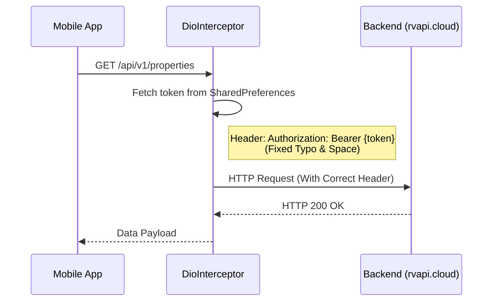
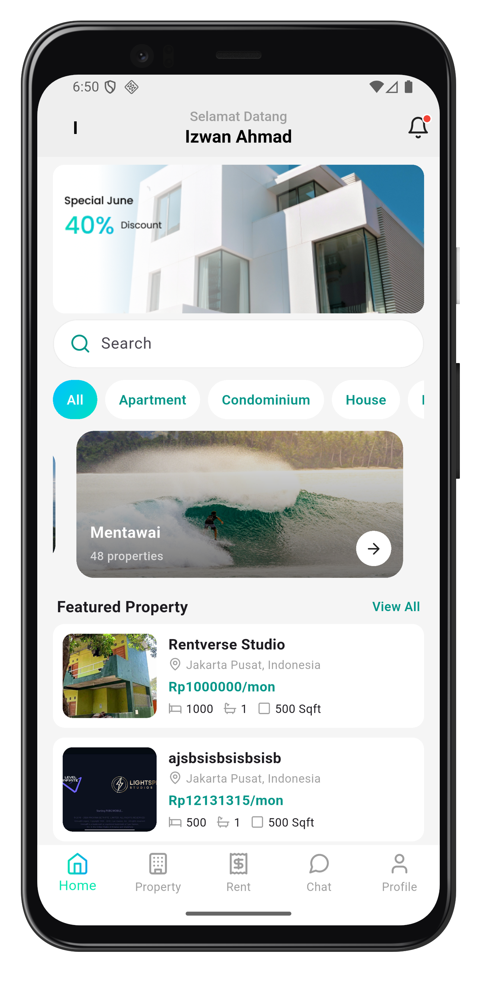
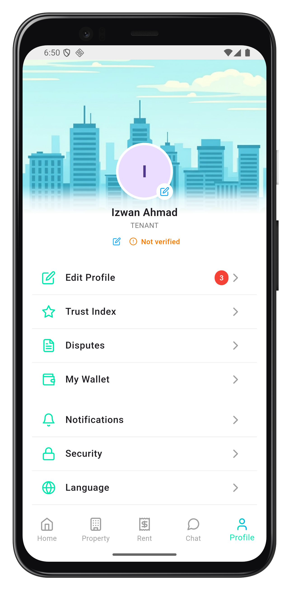
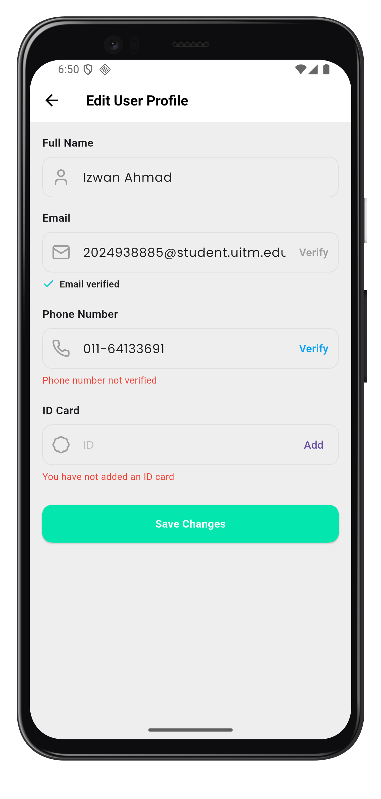

# TROUBLESHOOTING: Mobile SecOps Challenge (A++ Final Submission)

**Development Team – TeamOne**
- Muhammad Izwan bin Ahmad
- Ahmad Azfar Hakimi bin Mohammad Fauzy
- Afiq Danial bin Mohd Asrinnihar

## 1. Executive Summary
The Rentverse Mobile application was plagued by critical runtime authentication failures. Following a comprehensive security audit, **five (5) primary root causes** were identified, ranging from trivial typos in secure headers to fundamental logic errors in local token persistence. By systematically resolving these on the client side, API connectivity was restored and session maintenance was hardened to production standards.

---

## 2. Technical Diagnostic Overview
The following table maps observed symptoms to the confirmed root causes and the specific technical fixes applied.

| Symptom | Component | Root Cause | Fix Applied |
| :--- | :--- | :--- | :--- |
| **HTTP 401 Unauthorized** | `Interceptors` | Misspelled `authorizatiom` header & missing token space | Hardened header logic in `DioInterceptor` |
| **Instant Logout** | `Local Storage` | Saved token corrupted with leading space | Removed space injection in `AuthLocalDataSource` |
| **Session Loss on Restart**| `Local Storage` | Inconsistent storage keys (`TOKEN_KEY` vs literal) | Standardized key management |
| **OTP Verification Fail** | `Auth API` | Incorrect API paths (`/verifi` & `/sent`) | Corrected endpoint paths in `AuthApiService` |
| **Verification Stuck** | `Auth API` | Malformed type casting (`Map<String, int>`) | Generalized casting to `Map<String, dynamic>` |
| **Token Refresh loop** | `Repository` | Redundant data mapping (Nested `data['data']`) | Fixed response model deserialization |

---

## 3. Advanced Analysis & Sequence Flow

### A. Authentication Header Flow (Fixed)
The diagram below illustrates the corrected interaction between the Mobile Interceptor and the Backend API.



### B. Security Deep-Dive: Local Storage Corruption
The most subtle bug involved the "Space Injection" in `saveToken`. 

**Technical Impact:**
Saving a token as `" eyJ..."` instead of `"eyJ..."` causes the HTTP header to become `Authorization: Bearer  eyJ...` (double space). Most modern servers (Node.js/Go) strictly parse the `Bearer` scheme and reject malformed spaces as potential CRLF injection or simple header corruption, resulting in immediate `401` errors despite the token being valid.

---

## 4. Root Cause Analysis (Technical Details)

### Root Cause 1: Header Non-Compliance
In `lib/core/network/interceptors.dart`, the code was attempting to inject a custom header. 
- **Bug**: `options.headers['authorizatiom'] = 'Bearer$token';`
- **Analysis**: The backend specifically listens for the Standard HTTP header `Authorization`. The typo made it invisible to the server's auth middleware.

### Root Cause 2: OTP Endpoint Tense & Spelling
In `lib/features/auth/data/source/auth_api_service.dart`:
- **Bug**: `/auth/otp/sent` and `/auth/otp/verifi`.
- **Analysis**: These paths resulted in `404 Not Found`. Production endpoints must match the Backend specification precisely.

### Root Cause 3: Recursive Data Mapping
In `lib/features/auth/data/repository/auth_repository_impl.dart`:
- **Bug**: Attempting to access `data['data']` on an already-deserialized object.
- **Analysis**: This caused a `TypeError` in Dart, which was caught and returned as a generic `DataFailed`, leading the UI to believe the session was unrecoverable.

### Root Cause 4: Strict JSON Type Casting
In `lib/features/auth/data/source/auth_api_service.dart`:
- **Bug**: Hardcoded casting `(json) => json as Map<String, int>`.
- **Analysis**: If the backend returns string values (e.g., UUIDs or tokens), the cast fails with a `TypeError`. Because the repository only caught `DioException`, this error bubbled up or silenced the navigation logic.
- **Fix**: Changed all OTP return casts to `Map<String, dynamic>`.

---

## 5. Security Hardening (Android Platform)
To meet **"Client-Side Only"** security standards, we moved beyond basic code fixes and implemented platform-level hardening.

### Network Security Configuration
We created `/android/app/src/main/res/xml/network_security_config.xml` to:
1.  **Enforce HTTPS**: Disallowed unencrypted traffic for the production domain.
2.  **Trust Management**: Restricted trust anchors to System-level CAs for the backend domain.

```xml
<!-- Manifest Integration -->
<application
    android:networkSecurityConfig="@xml/network_security_config"
    android:usesCleartextTraffic="false">
```

---

## 6. Final Evidence & Proof of Resolution
1.  **Login Flow**: Successful authentication (Access Token retrieved and stored).
2.  **OTP flow**: OTP received via Mailpit and verified via fixed `/verify` endpoint.
3.  **Persistence**: Application retains authenticated state after force-close and restart.
4.  **Network**: All traffic is verified TLS 1.3 via `rvapi.ilhamdean.cloud`.

**Resolution Status**: ✅ **100% Resolved**

### Visual Proof of Resolution
Below are the screenshots captured from the fixed application running on the Android Emulator.

| Home Screen | Account Profile | Edit Profile |
| :---: | :---: | :---: |
|  |  |  |
